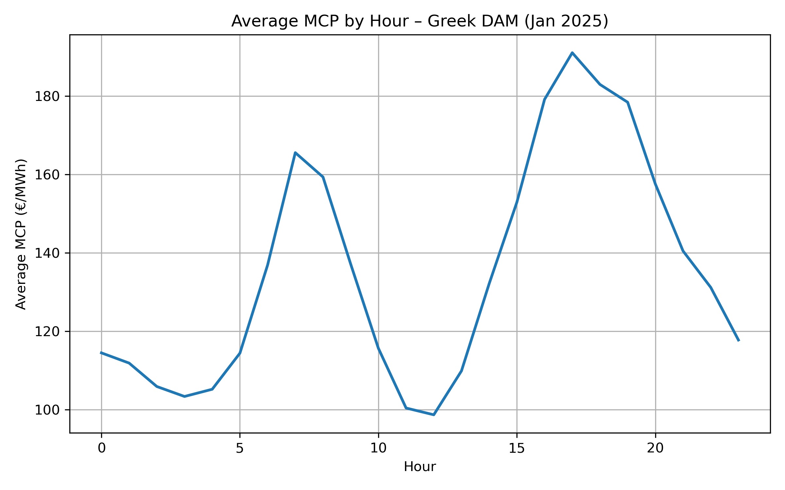
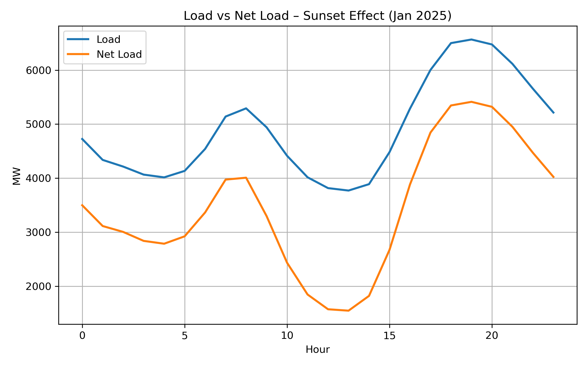
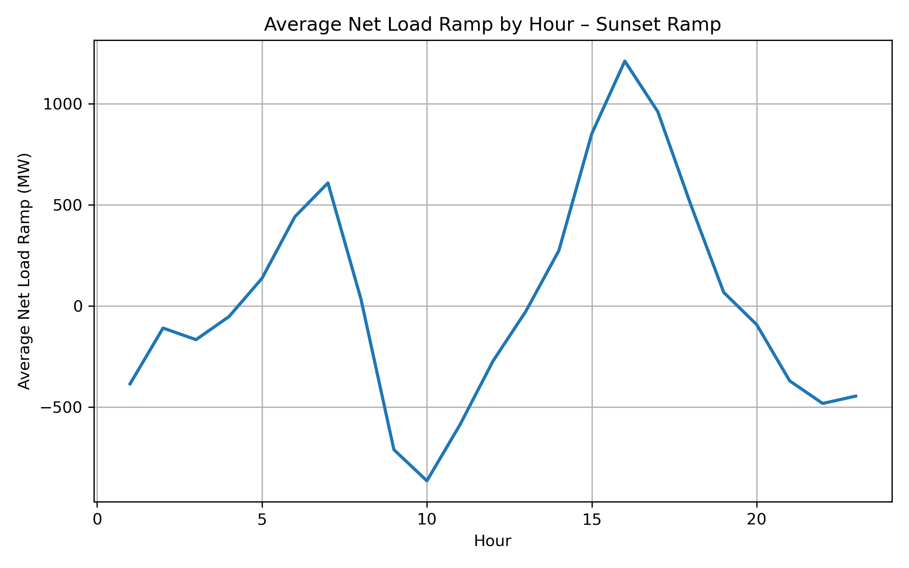
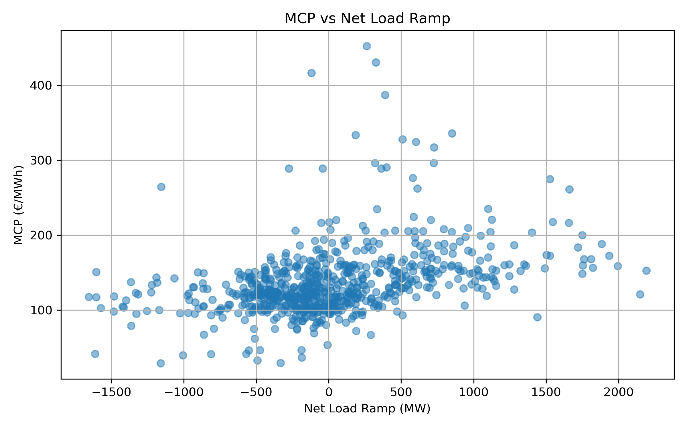

# Hourly Price Dynamics in the Greek Day-Ahead Market  
## An Exploratory Analysis of Load, Renewables and Residual Demand Ramps (January 2025)

---

## Overview

This project explores hourly price dynamics in the Greek Day-Ahead Market (DAM) using January 2025 data (744 hourly observations).

The objective is to understand how electricity prices evolve throughout the day and how they relate to:

- System Load  
- Renewable energy injections  
- Net Load (Load − RES)  
- Residual demand ramps  

The analysis is purely data-driven and focuses on identifying observable patterns in hourly price formation.

---

## Data Sources

- **HEnEx** — Day-Ahead Market results (MCP)
- **ADMIE** — System Load data
- **ADMIE** — Renewable generation injections

Period analyzed:
- January 2025
- 31 days
- 744 hourly observations

The final merged dataset includes:

- `MCP`
- `Load`
- `RES`
- `Net Load`
- `Ramp (Δ Net Load)`

---

## Methodology

1. Merge MCP, Load and RES datasets by date and hour.
2. Compute: Net Load = Load − RES
3. Compute hourly residual demand ramps: Ramp = Δ(Net Load)
4. Analyze:
- Hourly averages
- Correlations
- Ramp–price relationships
- Visual patterns in evening dynamics

---

## Key Visualizations

### 1️⃣ Average MCP by Hour

Observation:
Hourly prices exhibit clear intraday structure, with elevated levels during evening hours.

---

### 2️⃣ Load vs Net Load

Observation:
While total load increases into the evening, net load dynamics differ significantly due to renewable generation patterns.

---

### 3️⃣ Average Net Load Ramp by Hour

Observation:
Residual demand ramps increase sharply in the late afternoon and early evening, coinciding with declining solar output.

---

### 4️⃣ MCP vs Net Load Ramp

Observation:
Positive net-load ramps show a meaningful relationship with price levels, suggesting that price formation is influenced not only by demand levels but also by system transitions.

---

## Main Findings

- MCP correlates with Load (~0.63)
- MCP correlates with Net Load (~0.60)
- Peak prices occur before peak load
- Positive residual demand ramps show moderate correlation with price (~0.40)

These observations suggest that hourly price formation in the Greek DAM is influenced not only by absolute demand levels but also by dynamic system conditions and ramp effects.

Electricity markets respond to system stress — not just peak demand.

---

## Repository Structure

